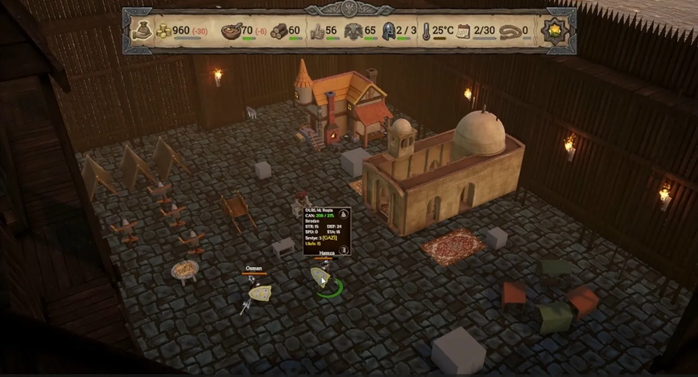
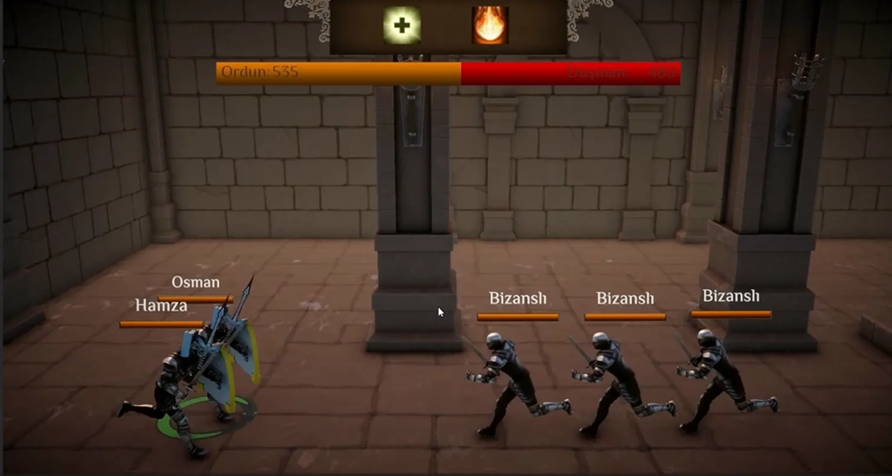
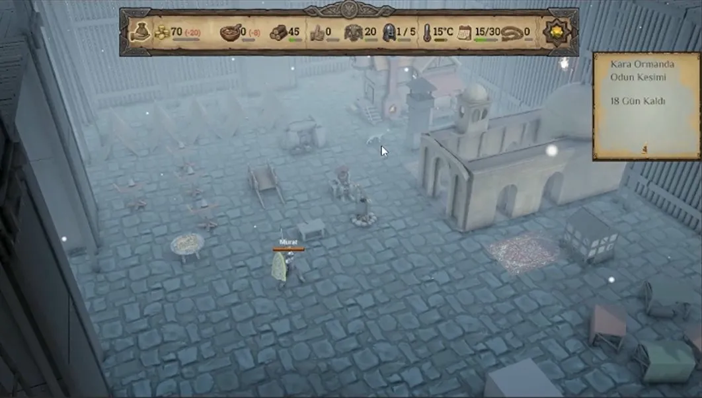
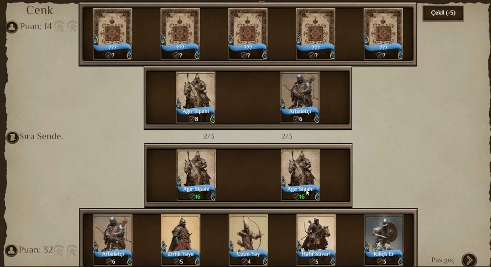

# ⚔️ Otagama

> *A camp management & tactical battle game set in the Ottoman era — inspired by Domina*


---

## 📸 Screenshots

| Camp Management | Battle |
|---|---|
|  |  |

| Winter Atmosphere | Cenk (Card Battle) |
|---|---|
|  |  |

---

## 🎮 About the Game

**Otagama** is a camp management and tactical battle game set in the Ottoman era. You recruit and train soldiers, manage your camp's resources day by day, and lead your army into battle across a strategic map.

The game blends **resource management**, **roguelike elements**, and **tactical combat** — every soldier has a name, a personality, and a story. Lose them and you lose them for good.

---

## ✨ Core Features

### 🏕️ Camp Management
- Build and upgrade camp structures (smithy, infirmary, training grounds, and more)
- Manage daily resources: **gold**, **food**, **wood**, **morale**, **reputation**
- Dynamic weather system — winter changes everything
- Camp events: wandering merchants, wild animals, visitors, crises

### ⚔️ Soldiers
- Each soldier has unique **stats** (STR, DEF, SPD, STA) and a **personality trait**
  - *e.g. "Gluttonous" — consumes more food but hits harder; "Devout" — prayer boosts morale*
- **Veteran (Gazi) system** — soldiers earn titles through battle
- Full equipment system: armor, swords, spears, shields
- **Permadeath** — fallen soldiers are gone for good

### 🗺️ Strategic Map
- Travel across a node-based map to reach battles, events, and points of interest
- **Scouting missions** — send soldiers ahead to gather intelligence
- Random events on the road: ambushes, discoveries, merchants

### ⚔️ Battle System
- Real-time combat with stats and equipment mattering
- Army health bar vs enemy — protect your soldiers
- Post-battle loot arrives by **supply cart**
- Multiple enemy factions with different equipment loadouts

### 🎲 Cenk (Card Battle)
- A separate card-based challenge mode
- Deploy unit cards (Ağır Sipahi, Arbaletçi, Uzun Yay, Hafif Süvari, etc.)
- Spend points wisely — or retreat at a cost (-5)

### 🌙 Nasip (Fate) System
- A luck/fate mechanic that influences random events
- Pray, pay your debts on time, and act with honor to increase your *nasip*
- When fate is full, rare rewards appear
- Roll dice to attempt to avoid battles entirely

---

## 🛠️ Tech Stack

| | |
|---|---|
| **Engine** | Unity 6 |
| **Language** | C# |
| **Rendering** | Custom shaders (ShaderLab / HLSL), post-processing |
| **Audio** | Custom AudioManager system |
| **Platform** | PC (mobile port in progress) |

---

## 🚧 Development Status

The game is actively in development. Current priorities:

- [ ] Mobile port
- [ ] UI polish (top bar → panels)
- [ ] Map events & visual improvements
- [ ] Optimization pass
- [ ] Save system

---

## 🗂️ Project Structure

```
Assets/
├── Scripts/
│   ├── Managers/        # GameManager, AudioManager, WorkplaceManager...
│   ├── Soldiers/        # Soldier stats, personality, inventory, AI
│   ├── Battle/          # Combat system, battle states
│   ├── Camp/            # Buildings, bonfire, day cycle
│   ├── Map/             # Node map, events, scouting
│   └── UI/              # Panels, topbar, notifications
├── Prefabs/
├── Scenes/
└── ...
```

---

## 🎯 Inspiration

- [**Domina**](https://store.steampowered.com/app/535230/Domina/) — gladiator camp management
- **Mount & Blade** — soldier management and morale systems
- **Slay the Spire** — roguelike progression and risk/reward decisions

---

## 👤 Developer

**Ahmet Bera Hasanoğlu**

---

*This project is a solo indie game in active development. Feedback and suggestions are welcome via Issues.*
